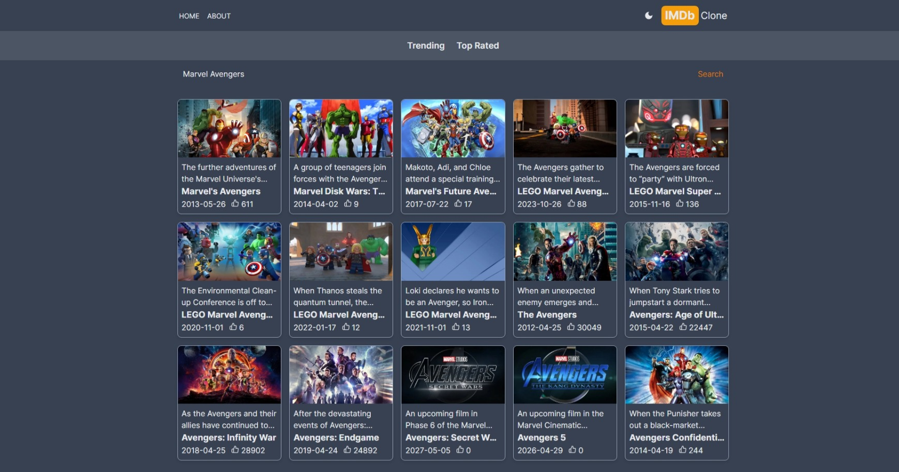
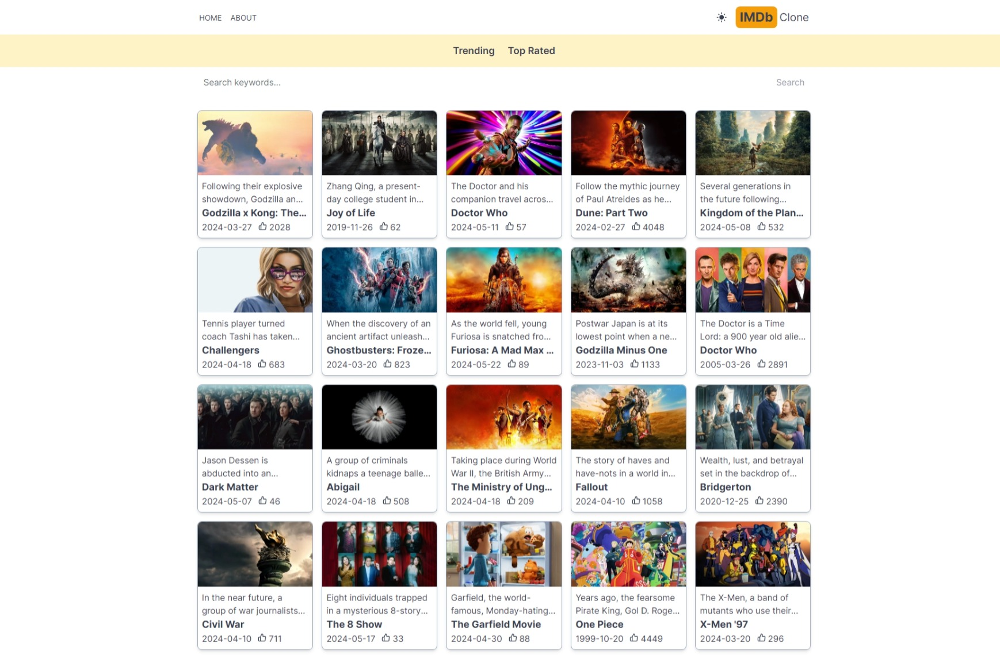
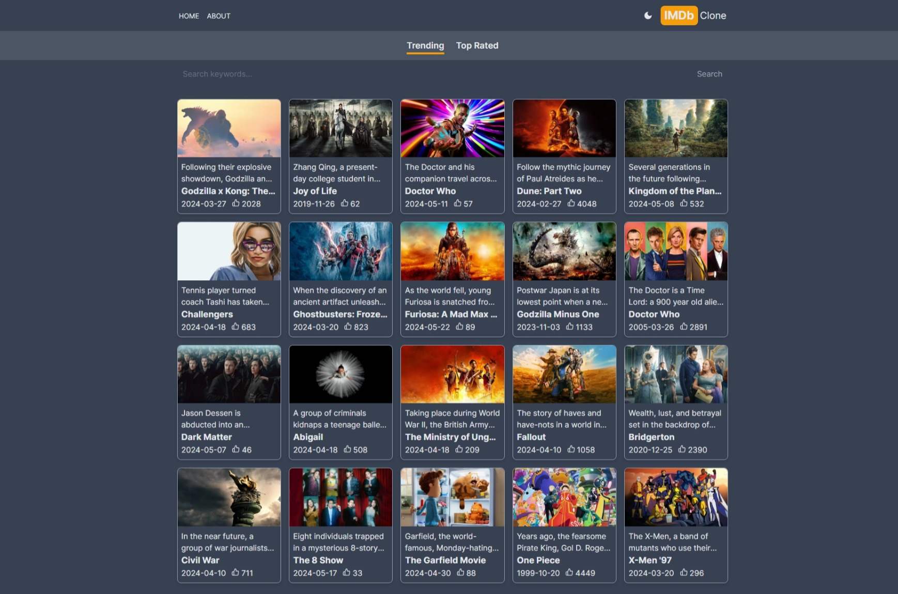
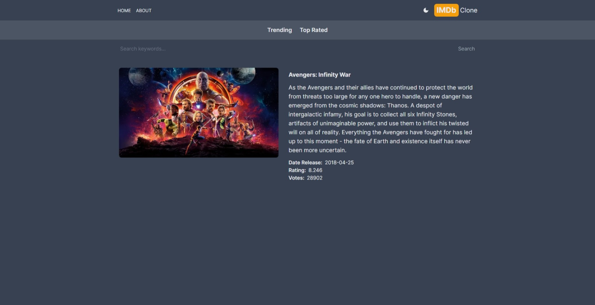
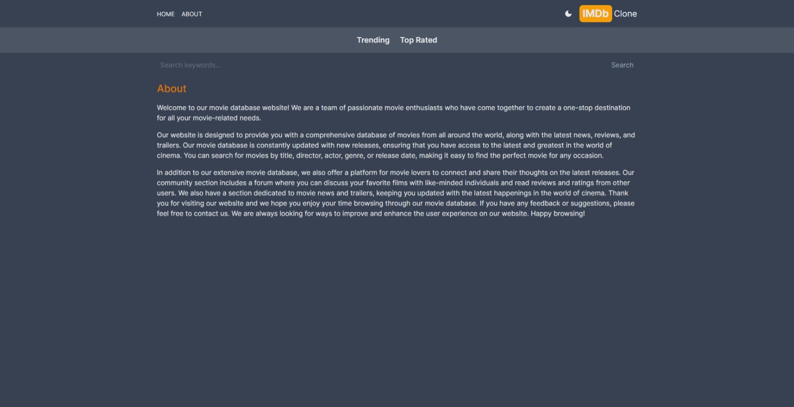

# IMDb Clone

This project is a clone of the popular movie database, IMDb, built using [Next.js](https://nextjs.org/), a powerful React framework for building efficient, user-friendly web applications. 

## Features

- **Movie Search:** Users can search for their favorite movies using the search functionality.
- **Movie Details:** Detailed information about each movie is available.
- **Responsive Design:** The application is designed to be responsive and works well on a variety of devices.

## Screenshots

  
  
  
  
  

## Getting Started

To get started with development:

1. Clone the repository.
2. Install the dependencies with `npm install`.
3. Start the development server with `npm run dev`.

The application will be available at [http://localhost:3000](http://localhost:3000).
